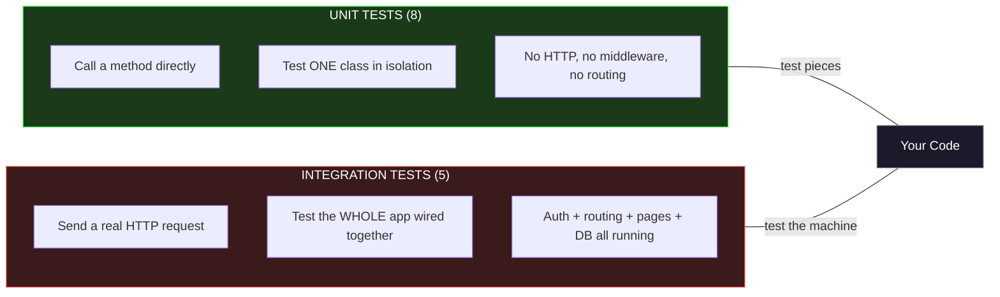
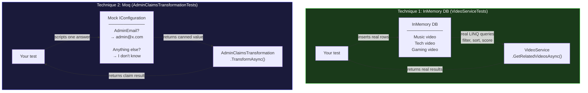
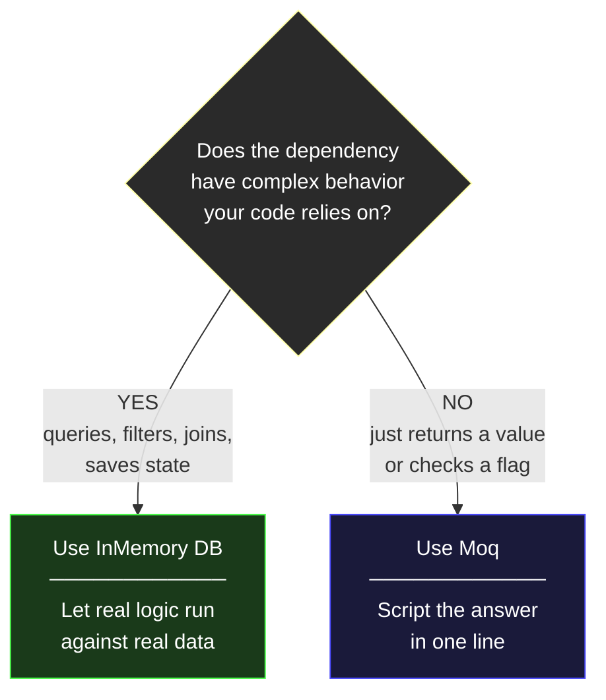
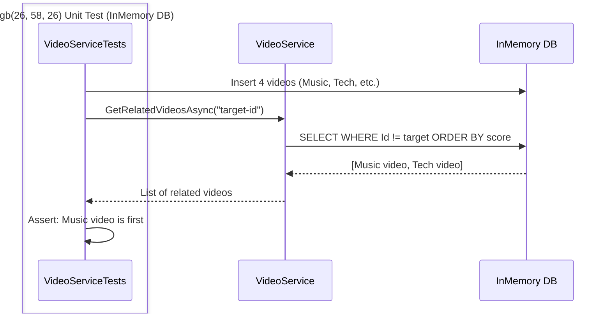
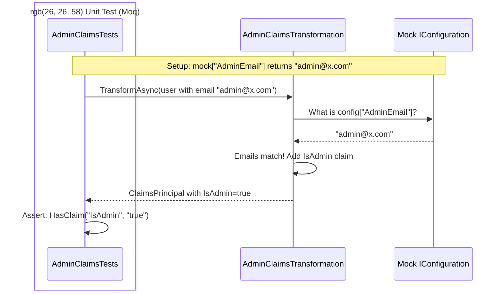
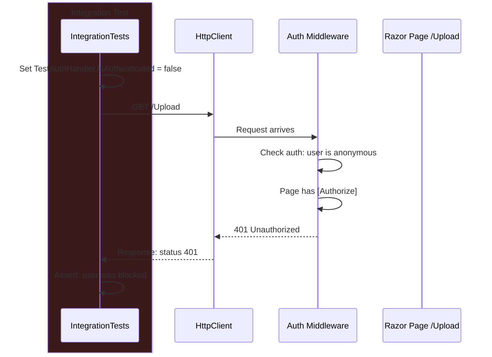
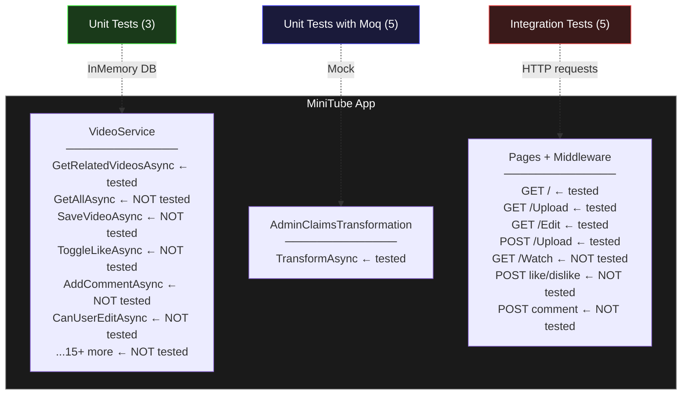

# MiniTube Test Suite — 13 tests

## The Big Picture



---

## Unit Tests: Two Techniques

Both are unit tests. The difference is how they fake the dependency.



### When to pick which?



---

## How Each Test Type Talks to the Code







---

## All 13 Tests at a Glance

### Unit Tests with InMemory DB (3) — VideoServiceTests.cs

Tests `VideoService.GetRelatedVideosAsync()` — the algorithm that picks which videos appear in the "Related Videos" sidebar.

```
┌─────────────────────────────────────────────────────────────────┐
│  TEST                          │  WHAT GOES IN    │  EXPECTED   │
├─────────────────────────────────────────────────────────────────┤
│  PrefersSameCategory           │  1 Music target   │  Music      │
│                                │  1 Music other    │  ranks      │
│                                │  2 other genres   │  first      │
├─────────────────────────────────────────────────────────────────┤
│  ExcludesCurrentVideo          │  target + 2 others│  target     │
│                                │                   │  NOT in     │
│                                │                   │  results    │
├─────────────────────────────────────────────────────────────────┤
│  ScoresSharedKeywordsHigher    │  "Razor Pages"    │  "Razor     │
│                                │  "Razor tutorial"  │  tutorial"  │
│                                │  "Cooking pasta"   │  ranks      │
│                                │                   │  above      │
│                                │                   │  "Cooking"  │
└─────────────────────────────────────────────────────────────────┘
```

### Unit Tests with Moq (5) — AdminClaimsTransformationTests.cs

Tests `AdminClaimsTransformation.TransformAsync()` — the logic that decides who gets admin privileges.

```
┌──────────────────────────────────────────────────────────────────────┐
│  TEST                          │  MOCK RETURNS     │  USER EMAIL    │  RESULT    │
├──────────────────────────────────────────────────────────────────────┤
│  EmailMatches                  │  admin@x.com      │  admin@x.com   │  IsAdmin   │
├──────────────────────────────────────────────────────────────────────┤
│  EmailDoesNotMatch             │  admin@x.com      │  random@x.com  │  No claim  │
├──────────────────────────────────────────────────────────────────────┤
│  NotAuthenticated              │  admin@x.com      │  (anonymous)   │  No claim  │
├──────────────────────────────────────────────────────────────────────┤
│  CaseInsensitive               │  admin@x.com      │  ADMIN@X.COM   │  IsAdmin   │
├──────────────────────────────────────────────────────────────────────┤
│  ConfigMissing                 │  null             │  anyone@x.com  │  No claim  │
└──────────────────────────────────────────────────────────────────────┘
```

### Integration Tests (5) — IntegrationTests.cs

Boots the full app and sends real HTTP requests.

```
┌──────────────────────────────────────────────────────────────────────┐
│  TEST                          │  REQUEST          │  USER STATE    │  EXPECTED  │
├──────────────────────────────────────────────────────────────────────┤
│  Homepage_Returns200           │  GET /             │  anonymous     │  200 OK    │
├──────────────────────────────────────────────────────────────────────┤
│  Upload_AnonymousIsBlocked     │  GET /Upload       │  anonymous     │  blocked   │
├──────────────────────────────────────────────────────────────────────┤
│  Edit_AnonymousIsBlocked       │  GET /Edit?id=x    │  anonymous     │  blocked   │
├──────────────────────────────────────────────────────────────────────┤
│  Upload_AuthenticatedReturns200│  GET /Upload       │  logged in     │  200 OK    │
├──────────────────────────────────────────────────────────────────────┤
│  Upload_ExeFileIsRejected      │  POST /Upload      │  logged in     │  rejected  │
│                                │  (malware.exe)     │                │            │
└──────────────────────────────────────────────────────────────────────┘
```

---

## What Covers What



---

## How to Run

```bash
# All 13 tests
dotnet test MiniTube.Tests/MiniTube.Tests.csproj --configuration Release

# Only unit tests (InMemory DB)
dotnet test MiniTube.Tests/MiniTube.Tests.csproj --filter "FullyQualifiedName~VideoServiceTests"

# Only unit tests (Moq)
dotnet test MiniTube.Tests/MiniTube.Tests.csproj --filter "FullyQualifiedName~AdminClaimsTransformation"

# Only integration tests
dotnet test MiniTube.Tests/MiniTube.Tests.csproj --filter "FullyQualifiedName~IntegrationTests"
```
