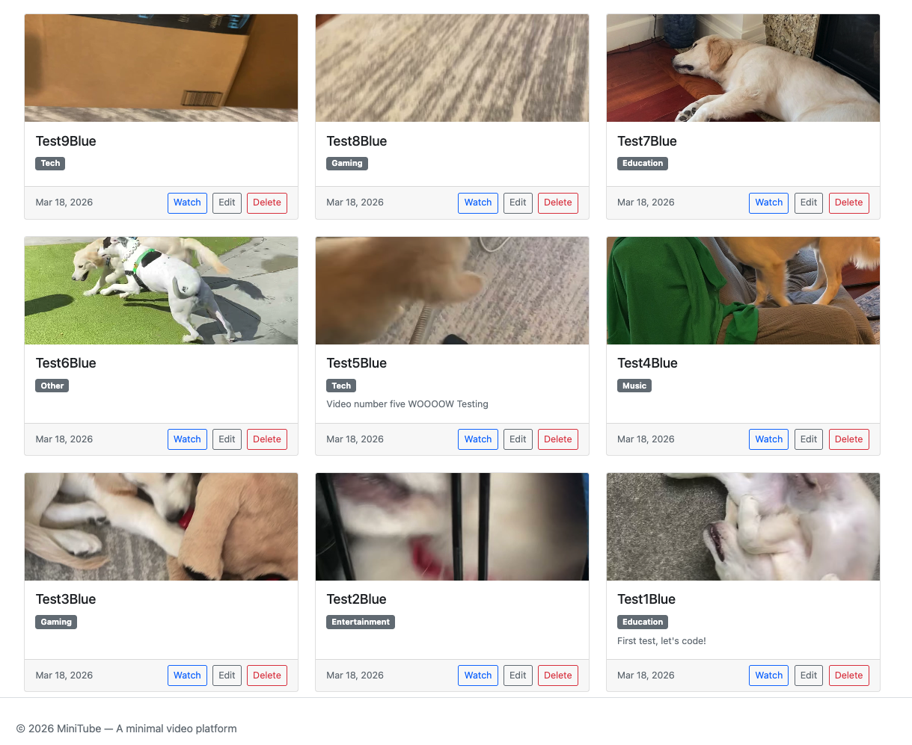
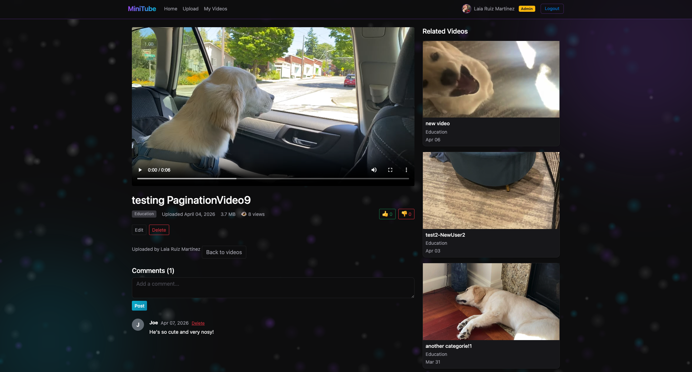
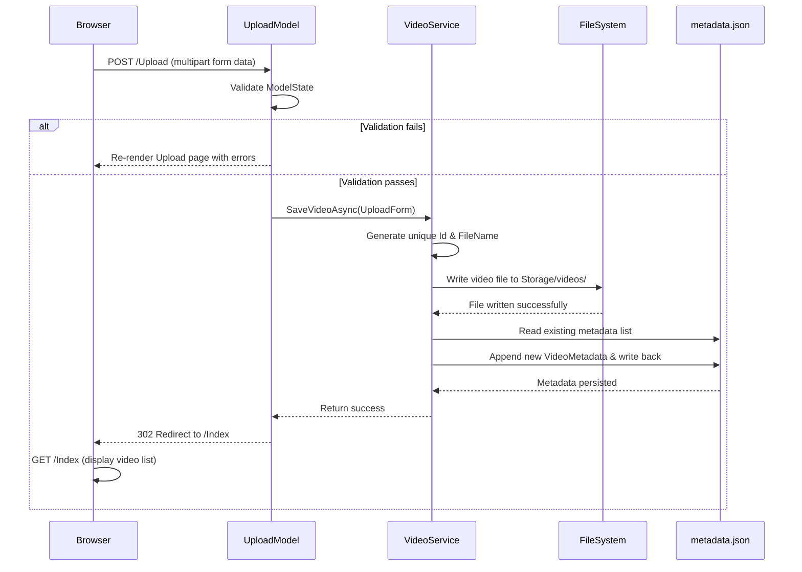
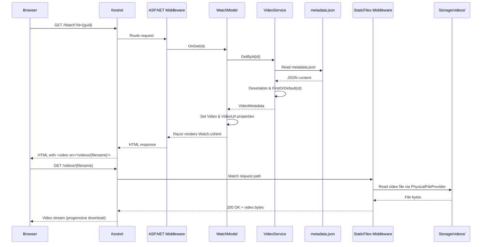

# MiniTube

**A clean, minimal video platform built with C# and ASP.NET Core — designed to showcase enterprise backend skills.**

Upload, browse, and play videos from a simple web UI. No cloud dependencies, no complex setup — just `dotnet run`.


---

## Quick Start
Run the project locally in seconds:

```bash
# Clone the repository
git clone https://github.com/LaiaRuizM/MiniTube.git

# Navigate into the project
cd MiniTube

# Run the application
dotnet run
```

Open **http://localhost:5028** → Upload a video → Watch it play.

---

## What It Does

| Feature | Description |
|---------|-------------|
| **Upload** | Drag-and-drop `.mp4`, `.webm`, `.mov` files (up to 500 MB) with title, description, and category |
| **Browse** | Responsive card grid showing all uploaded videos, sorted by newest first |
| **Play** | In-browser `<video>` player with full metadata display |
| **Validate** | Server-side validation with data annotations — file type, size, required fields |
| **Persist** | Metadata stored in JSON, video files on local disk — zero database setup needed |
| **Edit & Delete** | Update video metadata or remove videos entirely |
| **Thumbnails** | Auto-generated from video frames (2-second mark) for visual browsing |

---

## Features in Action

### Index Page — Video Grid with Thumbnails



Browse all uploaded videos in a clean, responsive grid. Each card shows:
- **Thumbnail preview** — Auto-generated from the video's 2-second frame
- **Video title** and category badge
- **Upload date** for sorting context
- **Action buttons** — Watch, Edit, or Delete

Videos are sorted by newest first, making it easy to find recent uploads.

---

### Watch Page — Player with "Other Videos" Sidebar



Clean two-column layout optimized for focused viewing:

**Left side (8 columns):**
- Full-featured HTML5 `<video>` player with controls
- Video title, category, upload date, and file size
- Video description in a card
- Edit and Delete buttons for quick access
- "Back to videos" link for navigation

**Right sidebar (4 columns):**
- **"Other Videos"** section showing all other uploaded videos
- Thumbnail previews for quick visual scanning
- Video metadata (title, category, date)
- Click any video to watch — no page reload needed
- Sticky positioning keeps the sidebar visible while scrolling

---

## Architecture

```
┌─────────────────────────────────────────────────────┐
│                    Browser (UI)                      │
│  ┌──────────┐   ┌──────────┐   ┌────────────────┐   │
│  │  Index    │   │  Upload  │   │  Watch         │   │
│  │  (list)   │──▶│  (form)  │   │  (<video> tag) │   │
│  └────┬─────┘   └────┬─────┘   └───────┬────────┘   │
└───────┼──────────────┼─────────────────┼─────────────┘
        │ GET /        │ POST /Upload    │ GET /Watch?id=
        ▼              ▼                 ▼
┌─────────────────────────────────────────────────────┐
│              ASP.NET Core Razor Pages                │
│  ┌──────────┐   ┌──────────┐   ┌──────────┐        │
│  │IndexModel│   │UploadModel│  │WatchModel │        │
│  └────┬─────┘   └────┬─────┘   └────┬─────┘        │
│       └───────────────┼──────────────┘              │
│                       ▼                             │
│              ┌──────────────┐                       │
│              │ VideoService │  (Singleton via DI)   │
│              └──────┬───────┘                       │
└─────────────────────┼───────────────────────────────┘
                      ▼
┌─────────────────────────────────────────────────────┐
│                    Storage/                          │
│     videos/               metadata.json             │
│     ├── a1b2...mp4        [{ Id, Title, ... }]      │
│     └── c3d4...webm                                 │
└─────────────────────────────────────────────────────┘
```

### Upload Flow

The following sequence diagram shows the primary interactions between the browser, the Upload PageModel, VideoService, and the underlying storage when a user uploads a video.



### Playback Flow

This diagram shows the complete end-to-end flow: the browser requests the Watch page, the server fetches metadata and renders HTML, then the browser's `<video>` element requests the actual video file which is served by the StaticFiles middleware.



---

## Tech Stack & Skills Demonstrated

| Area | What's Used | Why It Matters |
|------|-------------|----------------|
| **Framework** | ASP.NET Core 8, Razor Pages | Industry-standard enterprise web framework |
| **Architecture** | Pages → Services → Storage separation | Clean layering, ready for DI swap to database/cloud |
| **Model Binding** | `[BindProperty]`, `IFormFile` | Core ASP.NET skill for form handling |
| **Validation** | Data Annotations (`[Required]`, `[MaxLength]`) | Server-side validation pipeline |
| **Dependency Injection** | `builder.Services.AddSingleton<VideoService>()` | First-class DI, easy to swap implementations |
| **File I/O** | `FileStream`, `async/await`, `System.Text.Json` | Real file handling with async patterns |
| **Static Files** | `PhysicalFileProvider`, custom `StaticFileOptions` | Serving user-uploaded content securely |
| **Thread Safety** | `lock` on shared JSON metadata | Concurrency awareness for singleton services |

---

## Project Structure

```
MiniTube/
├── Models/
│   ├── VideoMetadata.cs        # Domain model
│   └── UploadForm.cs           # Form model with validation
├── Services/
│   └── VideoService.cs         # Business logic + persistence
├── Pages/
│   ├── Index.cshtml / .cs      # Video listing (home)
│   ├── Upload.cshtml / .cs     # Upload form + handler
│   ├── Watch.cshtml / .cs      # Video player page
│   └── Shared/_Layout.cshtml   # Shared layout with nav
├── Storage/
│   ├── videos/                 # Uploaded files (gitignored)
│   └── metadata.json           # Video metadata (gitignored)
├── Program.cs                  # App config, DI, middleware
└── docs/
    ├── upload-flow.md          # 10 upload architecture diagrams
    └── playback-flow.md        # 10 playback architecture diagrams
```

---

## Roadmap

### Phase 2 — Polish & Features
- SQLite + Entity Framework Core (replace JSON storage)
- Thumbnail generation (FFmpeg or placeholder images)
- Search by title, filter by category
- Pagination
- REST API (`/api/videos`) alongside Razor Pages
- ASP.NET Core Identity (cookie auth)

### Phase 3 — Architecture & Cloud-Ready
- Background processing with `BackgroundService` (upload post-processing)
- Clean Architecture: `MiniTube.Core` / `MiniTube.Infrastructure` / `MiniTube.Web`
- `IVideoStorage` interface → swap local disk for Azure Blob Storage
- Docker + docker-compose
- Unit & integration tests with `WebApplicationFactory`
- CDN-ready video delivery design

---

## Design Decisions

| Decision | Rationale |
|----------|-----------|
| **Razor Pages over Minimal API** | Need server-rendered UI; Razor Pages map 1:1 to screens, common in enterprise shops |
| **JSON file over SQLite** | Fastest path to working MVP; swap to EF Core later without changing the service interface |
| **Singleton VideoService** | Single shared instance is fine for local dev; in production, swap to scoped + database |
| **`lock` for JSON writes** | Simple thread safety for a singleton writing to a shared file |
| **Static files for video serving** | Kestrel handles range requests and caching out of the box — no custom streaming code needed |

---

## License

MIT
