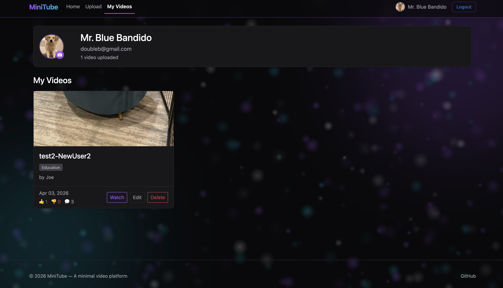
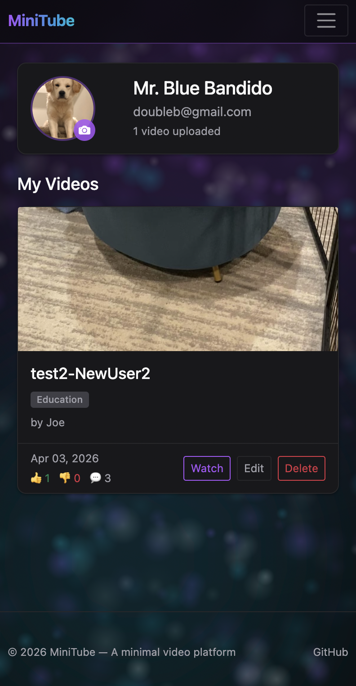
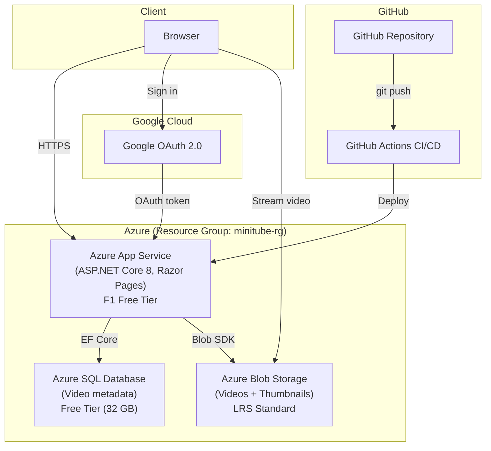

# MiniTube

**A clean, minimal video platform built with C# and ASP.NET Core — deployed on Azure with full cloud architecture.**

Upload, browse, and play videos with Google OAuth authentication, Azure SQL Database, and Azure Blob Storage.

[](https://github.com/LaiaRuizM/MiniTube/actions/workflows/azure-deploy.yml)


---

## Live Demo

**[https://minitube-laia-h2drgjdkd8hsg8cq.canadacentral-01.azurewebsites.net](https://minitube-laia-h2drgjdkd8hsg8cq.canadacentral-01.azurewebsites.net)**

Sign in with Google to upload videos. Browse and watch without login.

---

## Quick Start (Local Development)

```bash
git clone https://github.com/LaiaRuizM/MiniTube.git
cd MiniTube
dotnet run
```

Open **http://localhost:5028** → Sign in with Google → Upload a video → Watch it play.

---

## What It Does

| Feature | Description |
|---------|-------------|
| **Upload** | `.mp4`, `.webm`, `.mov` files (up to 500 MB locally, ~25 MB on Azure) with title, description, and category |
| **Browse** | Responsive card grid with auto-generated thumbnails, paginated 9 per page |
| **Search & Filter** | Search by title or description, filter by category, filters persist across pagination |
| **Play** | HTML5 `<video>` player with view counter and **Related Videos** sidebar (keyword-scored) |
| **Comments** | Post, view, and delete comments on any video — newest first, with avatar initials |
| **Likes / Dislikes** | Toggle like or dislike on videos, with live counts |
| **View Counts** | Tracked on each watch and shown on the player + index cards |
| **User Profiles** | "My Videos" page with profile picture upload and engagement stats (likes, dislikes, comments) |
| **Edit & Delete** | Update video metadata, replace video files, or remove entirely |
| **Thumbnails** | Auto-generated from video frames using FFmpeg, with fallback at 5s → 2s → 1s → 0s |
| **Google OAuth** | Sign in with Gmail — users can only edit/delete their own content |
| **Admin Role** | Admin has full control over all videos and comments |
| **Cloud Storage** | Videos, thumbnails, and avatars stored in Azure Blob Storage with private SAS URLs |
| **SQL Database** | Video metadata, likes, comments, and profiles stored in Azure SQL Database |
| **CI/CD** | Auto-deploy on push via GitHub Actions |

---

## Features in Action

### Index Page — Video Grid with Thumbnails


Browse all uploaded videos in a clean, responsive grid. Each card shows:
- **Thumbnail preview** — Auto-generated from the video's 2-second frame
- **Video title** and category badge
- **Upload date** for sorting context
- **Action buttons** — Watch, Edit, or Delete (owner/admin only)

---

### Watch Page — Player with Related Videos, Likes, and Comments


Two-column layout optimized for focused viewing:
- Full-featured HTML5 `<video>` player with controls
- Video metadata: title, category, date, file size, uploader, **view count**
- **Like / Dislike** buttons with toggle behavior and live counts
- **Comments section** — post, view, and delete (own comments or admin)
- **Related Videos sidebar** — top 5 videos scored by category match and shared keywords (see [Design Decisions](#design-decisions))
- Edit/Delete buttons visible only to the video owner or admin

---

### Profile Page — My Videos and Engagement Stats



Personal dashboard for signed-in users:
- **Profile picture upload** with camera-icon overlay and initial-letter fallback
- **My Videos** — all uploads by the current user
- **Engagement stats per video** — likes, dislikes, and comment counts at a glance

---

### Responsive Design



The entire app is mobile-friendly — the video grid collapses to a single column, the Watch page sidebar stacks below the player, and the navbar condenses cleanly on narrow screens.

---

## Architecture



### How It Works

1. **User visits the site** → Azure App Service serves the Razor Pages app
2. **User signs in** → Google OAuth authenticates and returns user info
3. **User uploads a video** → Video file goes to Azure Blob Storage, metadata to Azure SQL Database
4. **User watches a video** → App generates a temporary SAS URL for secure blob access
5. **CI/CD** → Every `git push` triggers GitHub Actions to auto-deploy

---

## Tech Stack & Skills Demonstrated

| Area | What's Used | Why It Matters |
|------|-------------|----------------|
| **Framework** | ASP.NET Core 8, Razor Pages | Industry-standard enterprise web framework |
| **Database** | Azure SQL Database, Entity Framework Core | Production-grade relational data with ORM |
| **Cloud Storage** | Azure Blob Storage | Scalable file storage with SAS token security |
| **Authentication** | Google OAuth 2.0 | Real-world SSO integration |
| **Authorization** | Claims-based roles (Admin/User) | Role-based access control with ownership checks |
| **CI/CD** | GitHub Actions | Automated deployment pipeline |
| **Cloud Hosting** | Azure App Service (Linux, F1) | Real cloud deployment with environment configuration |
| **Architecture** | Pages → Services → Azure | Clean layering with dependency injection |
| **Validation** | Data Annotations, server-side checks | Input validation at every layer |
| **Security** | Secrets in env vars, SAS tokens, HTTPS | Cloud security best practices |

---

## Project Structure

```
MiniTube/
├── Data/
│   └── MiniTubeDbContext.cs      # EF Core database context
├── Models/
│   ├── VideoMetadata.cs          # Domain model (SQL table)
│   ├── UploadForm.cs             # Upload form validation
│   └── EditForm.cs               # Edit form validation
├── Services/
│   ├── VideoService.cs           # Business logic (SQL + Blob)
│   └── AdminClaimsTransformation.cs  # Admin role assignment
├── Migrations/                   # EF Core database migrations
├── Pages/
│   ├── Index.cshtml / .cs        # Video listing (public)
│   ├── Upload.cshtml / .cs       # Upload form (auth required)
│   ├── Watch.cshtml / .cs        # Video player (public)
│   ├── Edit.cshtml / .cs         # Edit form (owner/admin)
│   ├── Account/
│   │   ├── Login.cshtml.cs       # Google OAuth redirect
│   │   └── Logout.cshtml.cs      # Sign out handler
│   └── Shared/_Layout.cshtml     # Nav with login/logout UI
├── .github/workflows/
│   └── azure-deploy.yml          # CI/CD pipeline
├── Program.cs                    # App config, DI, auth, middleware
└── web.config                    # IIS configuration for Azure
```

---

## Development Phases

Built iteratively, one feature at a time, with each phase shipped to production via CI/CD.

| Phase | What Was Built |
|-------|---------------|
| **Phase 1** | MVP — Upload, list, and play videos (local storage) |
| **Phase 2** | Thumbnails (FFmpeg), edit/delete, sidebar |
| **Phase 3** | Azure deployment — App Service, SQL Database, Blob Storage, CI/CD |
| **Phase 4** | Google OAuth with claims-based roles (Admin vs User) |
| **Phase 5** | Search by title/description and filter by category |
| **Phase 6** | User profile page with "My Videos" |
| **Phase 7** | Like / Dislike toggle system |
| **Phase 8** | Video comments — post, view, delete (own or admin) |
| **Phase 9** | UI polish — dark theme, bokeh background, flash messages, empty states |
| **Phase 10** | Profile picture upload with initial-letter fallback |
| **Phase 11** | Engagement counts (likes, dislikes, comments) on My Videos |
| **Phase 12** | Video view counts and pagination (9 per page) with filter persistence |
| **Phase 13** | Keyword-scored Related Videos sidebar (Option B: embeddings upgrade documented) |

---

## Design Decisions

| Decision | Rationale |
|----------|-----------|
| **Razor Pages over Minimal API** | Server-rendered UI maps 1:1 to screens; common in enterprise |
| **Azure SQL over JSON file** | Persistent, scalable storage; demonstrates EF Core skills |
| **Azure Blob Storage over local disk** | Files persist across deployments; scalable cloud storage |
| **Google OAuth over custom auth** | Real-world SSO; simpler than building registration/login |
| **Claims-based roles** | Lightweight authorization without a separate Users table |
| **SAS tokens for blob access** | Secure, time-limited URLs without exposing storage keys |
| **GitHub Actions CI/CD** | Industry-standard DevOps practice; auto-deploy on push |

---

## What I Learned

Building MiniTube end-to-end taught me concrete, production-grade skills that translate directly to real work:

- **Claims-based authorization in ASP.NET Core** — I used a custom `IClaimsTransformation` to attach an `IsAdmin` claim based on the authenticated email, then gated ownership-only actions (edit, delete, delete-comment) with explicit checks in each handler. This pattern scales cleanly without a separate `Users` table.
- **Secure private blob access with SAS URLs** — Uploaded videos live in a **private** Blob Storage container. On every watch, the app mints a short-lived (1-hour) SAS URL server-side, so the storage account key never leaves the server and links naturally expire.
- **Running FFmpeg as a child process** — The thumbnail pipeline shells out to FFmpeg with `ProcessStartInfo`, falling back across `5s → 2s → 1s → 0s` seek offsets so even short clips get a frame. A good lesson in handling external binaries and failure modes.
- **Handling Azure SQL free-tier auto-pause** — The free-tier database pauses after idle. I added a retry loop on startup so the first request after a pause doesn't 500 — a realistic lesson in designing around cloud constraints.
- **Razor Pages + Entity Framework Core migrations** — Each feature (likes, comments, profiles, view counts) meant a new model, a new migration, and a schema update pushed to production via CI/CD. I learned to keep migrations small and reversible.
- **CI/CD with GitHub Actions** — Every `git push` to `main` runs a build, publishes the app, and deploys to Azure App Service. No manual steps. Breaks are caught before I leave the terminal.
- **Incremental product thinking** — 13 phases, each shipping one cohesive feature (views, pagination, related videos, comments, etc.). I learned the value of small PRs over big-bang rewrites, and of documenting upgrade paths (e.g., the Option B embeddings plan for related videos) instead of over-engineering upfront.

---

## Roadmap

MiniTube is intentionally kept simple, but there are clean upgrade paths for each area:

- **Semantic related videos (Option B)** — Replace the current keyword scoring with OpenAI `text-embedding-3-small` vectors stored on `VideoMetadata`, using cosine similarity at watch time. Upgrade path documented in `Services/VideoService.cs`.
- **Admin dashboard** — Usage stats, top videos, user list. Read-only reporting on the existing tables.
- **Custom domain + HTTPS** — Replace the default `*.azurewebsites.net` URL with a branded domain.
- **README walkthrough GIF** — Short screen capture of upload → watch → comment flow.
- **Unit + integration tests** — `xUnit` for `VideoService` with an in-memory `DbContext`, plus Playwright for the critical user flows.

---

## License

MIT
