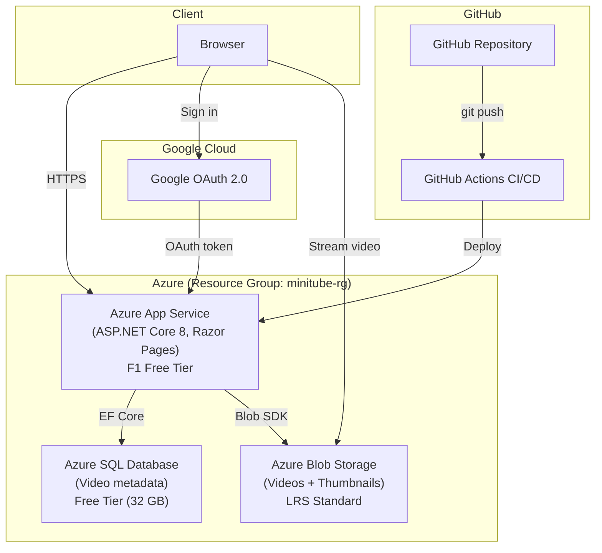

# MiniTube

**A clean, minimal video platform built with C# and ASP.NET Core — deployed on Azure with full cloud architecture.**

Upload, browse, and play videos with Google OAuth authentication, Azure SQL Database, and Azure Blob Storage.


---

## Live Demo

**[https://minitube-laia-h2drgjdkd8hsg8cq.canadacentral-01.azurewebsites.net](https://minitube-laia-h2drgjdkd8hsg8cq.canadacentral-01.azurewebsites.net)**

Sign in with Google to upload videos. Browse and watch without login.

---

## Quick Start (Local Development)

```bash
git clone https://github.com/LaiaRuizM/MiniTube.git
cd MiniTube
dotnet run
```

Open **http://localhost:5028** → Sign in with Google → Upload a video → Watch it play.

---

## What It Does

| Feature | Description |
|---------|-------------|
| **Upload** | `.mp4`, `.webm`, `.mov` files (up to 500 MB locally, ~25 MB on Azure) with title, description, and category |
| **Browse** | Responsive card grid with auto-generated thumbnails, sorted by newest first |
| **Play** | HTML5 `<video>` player with "Other Videos" sidebar |
| **Edit & Delete** | Update video metadata, replace video files, or remove entirely |
| **Thumbnails** | Auto-generated from video frames at the 2-second mark using FFmpeg |
| **Google OAuth** | Sign in with Gmail — users can only edit/delete their own videos |
| **Admin Role** | Admin has full control over all videos |
| **Cloud Storage** | Videos and thumbnails stored in Azure Blob Storage (persistent) |
| **SQL Database** | Video metadata stored in Azure SQL Database (persistent) |
| **CI/CD** | Auto-deploy on push via GitHub Actions |

---

## Features in Action

### Index Page — Video Grid with Thumbnails


Browse all uploaded videos in a clean, responsive grid. Each card shows:
- **Thumbnail preview** — Auto-generated from the video's 2-second frame
- **Video title** and category badge
- **Upload date** for sorting context
- **Action buttons** — Watch, Edit, or Delete (owner/admin only)

---

### Watch Page — Player with "Other Videos" Sidebar


Two-column layout optimized for focused viewing:
- Full-featured HTML5 `<video>` player with controls
- Video metadata (title, category, date, file size, uploader)
- **"Other Videos"** sidebar with thumbnail previews
- Edit/Delete buttons visible only to the video owner or admin

---

## Architecture



### How It Works

1. **User visits the site** → Azure App Service serves the Razor Pages app
2. **User signs in** → Google OAuth authenticates and returns user info
3. **User uploads a video** → Video file goes to Azure Blob Storage, metadata to Azure SQL Database
4. **User watches a video** → App generates a temporary SAS URL for secure blob access
5. **CI/CD** → Every `git push` triggers GitHub Actions to auto-deploy

---

## Tech Stack & Skills Demonstrated

| Area | What's Used | Why It Matters |
|------|-------------|----------------|
| **Framework** | ASP.NET Core 8, Razor Pages | Industry-standard enterprise web framework |
| **Database** | Azure SQL Database, Entity Framework Core | Production-grade relational data with ORM |
| **Cloud Storage** | Azure Blob Storage | Scalable file storage with SAS token security |
| **Authentication** | Google OAuth 2.0 | Real-world SSO integration |
| **Authorization** | Claims-based roles (Admin/User) | Role-based access control with ownership checks |
| **CI/CD** | GitHub Actions | Automated deployment pipeline |
| **Cloud Hosting** | Azure App Service (Linux, F1) | Real cloud deployment with environment configuration |
| **Architecture** | Pages → Services → Azure | Clean layering with dependency injection |
| **Validation** | Data Annotations, server-side checks | Input validation at every layer |
| **Security** | Secrets in env vars, SAS tokens, HTTPS | Cloud security best practices |

---

## Project Structure

```
MiniTube/
├── Data/
│   └── MiniTubeDbContext.cs      # EF Core database context
├── Models/
│   ├── VideoMetadata.cs          # Domain model (SQL table)
│   ├── UploadForm.cs             # Upload form validation
│   └── EditForm.cs               # Edit form validation
├── Services/
│   ├── VideoService.cs           # Business logic (SQL + Blob)
│   └── AdminClaimsTransformation.cs  # Admin role assignment
├── Migrations/                   # EF Core database migrations
├── Pages/
│   ├── Index.cshtml / .cs        # Video listing (public)
│   ├── Upload.cshtml / .cs       # Upload form (auth required)
│   ├── Watch.cshtml / .cs        # Video player (public)
│   ├── Edit.cshtml / .cs         # Edit form (owner/admin)
│   ├── Account/
│   │   ├── Login.cshtml.cs       # Google OAuth redirect
│   │   └── Logout.cshtml.cs      # Sign out handler
│   └── Shared/_Layout.cshtml     # Nav with login/logout UI
├── .github/workflows/
│   └── azure-deploy.yml          # CI/CD pipeline
├── Program.cs                    # App config, DI, auth, middleware
└── web.config                    # IIS configuration for Azure
```

---

## Development Phases

| Phase | What Was Built |
|-------|---------------|
| **Phase 1** | MVP — Upload, list, and play videos (local storage) |
| **Phase 2** | Thumbnails, edit/delete, "Other Videos" sidebar |
| **Phase 3** | Azure deployment — App Service, SQL Database, Blob Storage, CI/CD |
| **Phase 4** | Google OAuth with role-based authorization (Admin vs User) |

---

## Design Decisions

| Decision | Rationale |
|----------|-----------|
| **Razor Pages over Minimal API** | Server-rendered UI maps 1:1 to screens; common in enterprise |
| **Azure SQL over JSON file** | Persistent, scalable storage; demonstrates EF Core skills |
| **Azure Blob Storage over local disk** | Files persist across deployments; scalable cloud storage |
| **Google OAuth over custom auth** | Real-world SSO; simpler than building registration/login |
| **Claims-based roles** | Lightweight authorization without a separate Users table |
| **SAS tokens for blob access** | Secure, time-limited URLs without exposing storage keys |
| **GitHub Actions CI/CD** | Industry-standard DevOps practice; auto-deploy on push |

---

## License

MIT
